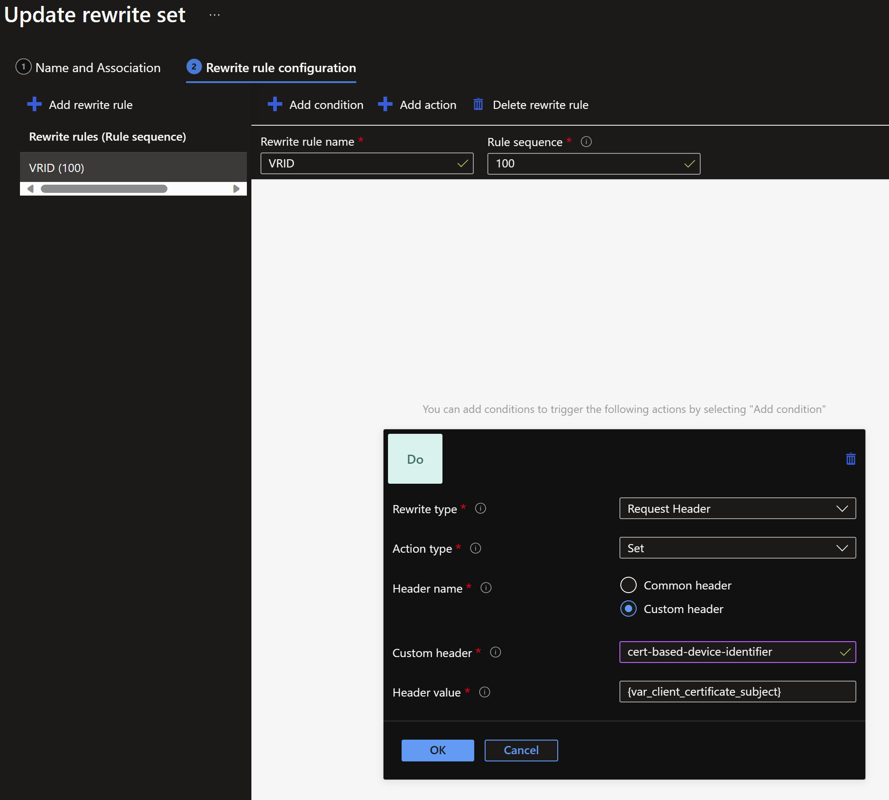

You can use Azure Application Gateway for more than just L7 load balancing. You can also use it to:
- Reduce the encryption and decryption overhead from a backend server farm.
- Pre-authenticate devices or software that connects to your backend services. This is useful when you want to allow only specific devices to connect to your backend services that have a certificate installed on them.

Lets' see how does the high level architecture looks like:
[](certificate_based_device_authentication_HLD.png)

We will make use of PowerShell to generate a root certificate authority that we will further use to sign the certificates to be used on the devices. 
In this example, we will use a self-signed certificate for the root CA, but you can use a certificate from a trusted CA as well. 
The load balancer will then use the root certificate's public key to validate the certificate that was used by the device to authenticate.

Let's have a look at the PowerShell script that we will use to generate the root certificate and the certificate to be used by the devices.

```powershell
# Define variables
$rootCertName = "My Root CA"
$certName = "My Signed Certificate"
$certPath = "Cert:\CurrentUser\My"
$certStore = "Cert:\CurrentUser\Root"
$PFXPassword = 'HelloKitty123!'

# Create a new self-signed certificate and install it in the \My store (needed for signing)
$rootCert = Get-ChildItem -Path $certStore | Where-Object { $_.Subject -eq "CN=$rootCertName" }
if (-not $rootCert) {
    $rootCert = New-SelfSignedCertificate `
        -DnsName $rootCertName `
        -Subject "CN=$rootCertName" `
        -CertStoreLocation $certPath `
        -Type Custom `
        -KeySpec Signature `
        -KeyUsage CertSign, CRLSign, DigitalSignature, KeyEncipherment `
        -FriendlyName $rootCertName `
        -NotAfter (Get-Date).AddYears(10) `
        -TextExtension @("2.5.29.19={text}CA=true")
}

#export the Public Key of the Root CA in base64 format
Set-Content -Path "$rootCertName.cer" -Value $([convert]::tobase64string($rootCert.RawData)) -Encoding ascii

# Install the certificate in the root store, if you want to try to authenticate from the current machine
$store = New-Object System.Security.Cryptography.X509Certificates.X509Store("Root", "CurrentUser" )
$store.Open([System.Security.Cryptography.X509Certificates.OpenFlags]::ReadWrite)
$store.Add($rootCert)
$store.Close()

# Create a new certificate and sign it with the CA created above
$signedCertificate = New-SelfSignedCertificate `
    -DnsName $certName `
    -CertStoreLocation $certPath `
    -Type Custom `
    -KeySpec Signature `
    -Subject "CN=$certName" `
    -KeyUsage DigitalSignature, KeyEncipherment `
    -FriendlyName $certName `
    -NotAfter (Get-Date).AddYears(1) `
    -Signer $rootCert

# Export the certificate for later usage in code
$signedCertificate | Export-PfxCertificate -Password $(ConvertTo-SecureString $PFXPassword -Force -AsPlainText) -FilePath "$certName.pfx"
```

At this step we have the root certificate installed in the local user's root store and we have the signed certificate exported as a PFX file.
Also the root certificate is exported as a .CER file (base64 encoded) that we will use to configure the load balancer.

Through the Azure Application Gateway's "SSL settings" blade we can configure the Client Authentication by uploading the .CER file that we exported earlier.
[](certificate_based_device_authentication_SSL_settings.png)

It is very important to configure the Listener to make use of the Client Authentication that we just configured.
[](certificate_based_device_authentication_listener.png)

As the Application Gateway is configured to use the Client Authentication, it will only allow the devices or the software that have a certificate signed by the root certificate that we uploaded earlier.
[](certificate_based_device_authentication_SSL_prompt.png)
In the picture above the Root CA is still listed as valid certificate for authentication because a certificate including it's private key is (still) installed on the machine that I used to take the screenshot.

You can make use of the code below to test the authentication against the Application Gateway using a regular C# console application.

```csharp
using System;
using System.Net.Http;
using System.Security.Cryptography.X509Certificates;

namespace CertificateBasedAuthentication
{
    class Program
    {
        static void Main(string[] args)
        {
            string pathToCertificate = "C:\\Users\\bgrozoiu\\My Signed Certificate.pfx";
            string certificatePassword = "HelloKitty123!";
            string apiEndpoint = "https://aag.itdelivery.ro";

            // Load the certificate from a file
            X509Certificate2 certificate = new X509Certificate2(pathToCertificate, certificatePassword);

            // Create a new HttpClientHandler and set the client certificate
            HttpClientHandler handler = new HttpClientHandler();
            handler.ClientCertificates.Add(certificate);

            // Create a new HttpClient with the handler
            HttpClient client = new HttpClient(handler);

            // Set the base address of the API
            client.BaseAddress = new Uri(apiEndpoint);

            // Make a GET request to the API
            HttpResponseMessage response = client.GetAsync("api/web").Result;

            // Check if the request was successful
            if (response.IsSuccessStatusCode)
            {
                // Read the response content
                string content = response.Content.ReadAsStringAsync().Result;

                // Display the response content
                Console.WriteLine(content);
            }
            else
            {
                // Display the error status code
                Console.WriteLine("Error: " + response.StatusCode);
            }

            // Wait for user input before closing the console window
            Console.ReadLine();
        }
    }
}
```

As the authentication is successful, we will extract some data that resides in the certificate used for authentication and passing it as a header towards the backend. We can achieve this by using an Application Gateway Rewrite Set. 

Application Gateway allows you to rewrite selected content of requests and responses. With this feature, you can translate URLs, query string parameters as well as modify request and response headers. It also allows you to add conditions to ensure that the URL or the specified headers are rewritten only when certain conditions are met. These conditions are based on the request and response information.

[](certificate_based_device_authentication_rewrite_set.png)

In the backend settings of the Application Gateway there is an Azure Function simply configured to throw back the headers that it receives.
[](certificate_based_device_authentication_bakend_answer.png)

If you want to try it out all by yourself, here's the code of the Azure Function. The most important configuration part of its code is to push back the headers that it receives from the Application Gateway.

```powershell
using namespace System.Net

# Input bindings are passed in via param block.
param($Request, $TriggerMetadata)
$TriggerMetadata

# Write to the Azure Functions log stream.
Write-Host "PowerShell HTTP trigger function processed a request."

# Associate values to output bindings by calling 'Push-OutputBinding'.
Push-OutputBinding -Name Response -Value ([HttpResponseContext]@{
    StatusCode = [HttpStatusCode]::OK
    Body = $TriggerMetadata.Headers
})
```


In this way I demonstrated how to generate a CA-signed certificate and use it to authenticate devices or software that are trying to access a web application through an Azure Application Gateway using [listener-specific SSL policies](https://learn.microsoft.com/en-us/azure/application-gateway/application-gateway-configure-listener-specific-ssl-policy) and [Rewrite Sets](https://learn.microsoft.com/en-us/azure/application-gateway/rewrite-http-headers-url).

Similarly, you can achieve a similar result with API Management Services. Learn [how to secure APIs using client certificate authentication in API Management](https://learn.microsoft.com/en-us/azure/api-management/api-management-howto-mutual-certificates-for-clients).

Please note that this scenario provides end-to-end security if the backends are also SSL enabled. If the backends are not SSL enabled, the traffic between the Application Gateway and the backend is not encrypted. If you do not intend to encrypt the traffic between the Application Gateway and the backend, you should at least ensure that your backend solution is only available over private networking to the Application Gateway and the traffic between the Application Gateway and the backend solution is strictly controlled.