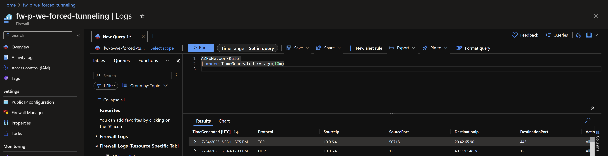

Some customers might have some exotic preferences when it comes to controlling the data paths, such as:
- not exposing a public IP directly to the internet (typical to banking orgs)
- routing entirely the outbound traffic through on-premises gateways (typical to governmental orgs)
- double traffic control to offer a high degree of flexibility to independent Landing Zone teams for East-West traffic management enriched by South-North strict traffic filtering (this scenario can also be achieved by enforcing Parent Azure Firewall Policies).

That's when [Azure Firewall Forced Tunneling](https://learn.microsoft.com/en-us/azure/firewall/forced-tunneling) comes to the rescue: when you configure a new Azure Firewall, you can route all Internet-bound traffic to a designated next hop instead of going directly to the Internet.
This setup can be achieved with typical Hub-Spoke network topologies (all scenarios supported), but also by leveraging the Azure Virtual WAN Secure Hub. Please note that if you deploy Azure Firewall inside of a Virtual WAN Hub (Secured Virtual Hub), advertising the default route over Express Route or VPN Gateway is not yet supported.

Let's have a look at how this can be achieved:

Here's 10 reasons on why you should reconsider such an architecture:
1. DNAT is not supported with Forced Tunneling enabled. Firewalls deployed with Forced Tunneling enabled can't support inbound access from the Internet because of asymmetric routing.
2. It is possible to achieve double firewalling in Azure using cloud native technologies, but this does not increase the overall security of the platform, but it is making it actually weaker because a misconfiguration on the 2x User Defined Routes in the diagram above has the potential introduce breaking changes in live environments.
3. Adding by mistake or by policy an UDR on the extra AzureFirewallManagementSubnet will prevent the firewall to work and to be configured.
4. In the Network Logs of the 2nd firewall (the one governing the Secure Hub 1) you will see traffic coming from one of the private IPs of the Azure Firewall with Forced Tunneling enabled, and not the real source (see pics below).
5. As all the traffic will run out through the firewall of Secure Hub, you will run at the risk of port exhaustion and the only solution will be to scale out using more Secure Hubs.
6. All the firewalls in other landing zones must be created with Force Tunneling enabled (cannot be later configured or removed).
7. Troubleshooting an architecture like that when escalations arrive will require excellent Azure networking expertise and a change in your organization processes to adapt to this niche configuration.
8. This setup requires more peerings to be created (and be managed) and your customer will pay significantly more as there will be more firewalls running in Azure and perhaps more DDOS protection plans (also very expensive).
9. There will be literally 2x more data in Log Analytics tables for each Firewall with Forced Tunneling enabled that you add to the overall architecture (pretty expensive as per my experience).
10. Each team maintaining their own landing zone will have to maintain their own policy(-ies), instead of a running this centralized with Parent Policies.

--------

As mentioned above, in the Azure Firewall with Forced Tunneling enabled, you will be able to detect clearly the interface that generated the traffic:

While in the logs of the Firewall governing the Secure Hub you will see generic traffic coming from one of the private IPs of the Firewall with Forced Tunnelling:

--------

To wrap it up, I would strongly recommend against this complicated architecture and only consider it if there are hard requirements to flow all the internet bound traffic back through on-prem devices residing in physical locations or NVAs.

A more secure and reliable architecture can be achieved by using Azure Firewall for Delivery Platforms (such as Application Gateways and Front Doors) next to DDOS protection plans and make use of only one Azure Firewall for Virtual Networks or Secure Hubs. Less is more 😉