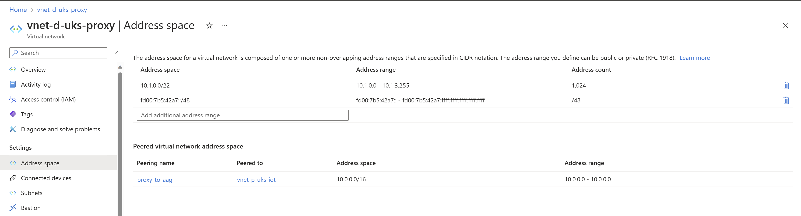

# IPv6 on Azure Application Gateway is not available yet

For the time being Azure Application Gateways do not support IPv6. This is a workaround to expose your application to the internet using Azure Application Gateway using both IPv4 and IPv6. Until the Product Groups of Azure Application Gateway will implement IPv6 support for the Public Listener, you may want to implement an architecture like the one described in this article and make sure that all the ingress towards your application's backend flows through the Azure Application Gateway, regardless of the IP stack.

Why not choose the Azure Front Door for the Azure Application Gateway? Well, even though the Azure Front Door supports IPv6 and it is also a global resource, it does not support Web Sockets which are useful for streaming or other real-time scenarios. So, if you need Web Sockets, you need to use the Azure Application Gateway (which does not support yet IPv6).

# The Alternative Architecture

You will need to create a Virtual Machine with two network interface configurations, one for IPv4 and one for IPv6. The IPv4 network interface configuration will be used to connect to the Azure Application Gateway, using a peered network or any other method that will allow its NIC to establish a TCP/UDP transport. The IPv6 network interface configuration will have a routable public IPv6 address and a private IPv6 address. The Virtual Machine will accept requests on IPv6 and optionally on IPv4, but it will be configured with an upstream server that is listening on IPv4 (this will be the private listener of the Azure Application Gateway)

Lets' see how does the high level architecture looks like:
[](IPv6-aag-workaround-hld.png)
 _Click on the image to enlarge it._

# The Implementation of IPv6 in front of the Azure Application Gateway

* On your AAG, create a Private Listener on the same protocol, but a different port, and create a rule towards the same backend pool as the Public Listener. The Private Listener will be used by the Virtual Machine to connect to the Azure Application Gateway.

[](aag-private-listener.png)
Create a private listener on the same protocol, but a different port, and then create a rule towards the same backend pool as the Public Listener. The Private Listener will be used by the Proxy Virtual Machine to connect to the Azure Application Gateway.

[](aag-listeners-overview.png)
Your Azure Application Gateway's listners overview should look like above.

[](aag-rule-for-private-listener-frontend.png)
Create a new rule that references the private Listener.

[](aag-rule-for-private-listener-backend.png)
Reference the same backend pool as the Public Listener, with the same settings, for a consistent experience.

* On a peered network with double IP stack (or a different subnet) governed by a different Network Security Group, create one or more linux virtual machines and make sure that you have 2 IP configs - one for the IPv4 stack and one for the IPv6 stack, similar to this setup. 
It is not required that you place a Public IPv4 IP on ipconfig1, but it is a must to place a Public IPv6 IP on the secondary config (make sure the subnet leases private IPv6 IPs to the connected devices)

[](proxy-vnet-address-space-configuration.png)
Ensure that your new Virtual Network has double IP stack, such as 10.0.1.0/24 for the IPv4 IP configurations and fd00:7b5:42a7::/48 for IPv6 NIC configurations.


[](proxy-vm-nic-dual-ip-configuration.png)
Configure the Network Interface of the Virtual Machine with two IP configurations, one for IPv4 and one for IPv6.

[](proxy-vnet-connected-devices.png)
Make sure that you can see both IP configurations as connected devices in the Virtual Network connected devices view.
Make sure to have at least one IPv6 address that is routable to the internet and that is added to the Secondary Network Interface configuration.

[](proxy-vnet-peering-overview.png)
Peer the 2 Virtual Networks together.

[](proxy-vnet-peering-detail.png)
Ensure you allow the traffic to and from the remote VNET.

[](proxy-vm-overview.png)
Make sure the Virtual Machine that will stream the IPv6 requests towards the Application Gateway's private listener's IP has both IPv4 and IPv6 addresses (out of which only IPv6 must be internet routable). I've used also a public IPv4 IP for the sake of simplicity of access, but it is not required.

* Onto the linux VMs you may install NGINX and configure it for streaming (as it supports and is intended for web sockets), as per bellow. Obviously the 10.0.0.4 is the Frontend IP of the Private Listener you configured above.

```bash
#nginx.conf
stream {
        server {
                listen [::]:443;
                proxy_pass 10.0.0.4:444;
        }
}
```

* In front of everything, please place a Traffic Manager, pointing to both the IPv4 Frontend IP of the AAG and the IPv6 Public (routable) IP(-s) of the reverse proxy NGINX VM(s).

**Note:** Make sure that your NGINX VM(s) or HAProxy have as backend the private IP of the AAG Listener, and not the backend of the AAG itself. 
This way you will have full control of the traffic towards the backend with a proper tool for L7 load balancing (the AAG), were firewall policies can be applied and many other more, such as rewrite set, certificate based authentication, etc.

In such as scenario, Accelerated Networking NICs might bring visible advantages thanks to the low latency capabilities.

Until the Azure Product Group for Azure Application Gateway will rollout the IPv6 support for the Public Listener, please consider this architecture as a workaround that will allow you to expose your application to the internet using both IPv4 and IPv6.