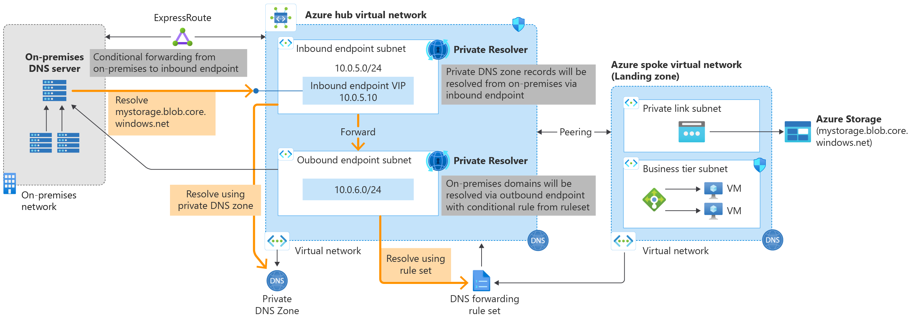
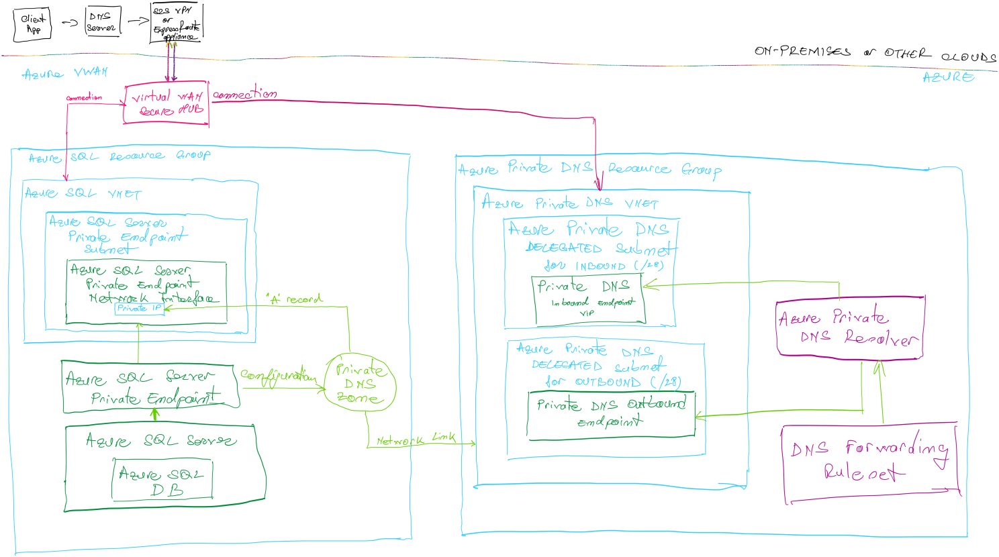

How many times haven't you been stuck while trying to establish a hybrid connectivity model between your customers` traditional datacenters and the Azure cloud? How many times did you have to update manually the hosts file on various servers to reach out to your blobs in a Storage Account or your Azure SQL Server properly hidden from the internet, by using private links? The service was available, routes were established and working, but still unreachable from on-prem because the client servers "didn't know" the IP address of the private Azure endpoint belonging to the resource you were trying to connect to (and of course, the connection with the Azure resource is established only on FQDN calls and if secured).

Microsoft introduced the [Azure Private DNS Resolver](https://learn.microsoft.com/en-us/azure/dns/dns-private-resolver-overview) (now GA) to be queried conditionally from on-premises or from other networks that do not have or do not support private DNS links. And vice-versa.

## What is it?

The Private DNS Resolver is a fully managed Azure service (so you don't have to care about zone redundancy, availability or scalability) and it is DevOps friendly. With the help of it, you can forward conditionally the name resolution requests to and from on-premises DNS servers or even other Azure networks.

## How does it work?
Very simple and intuitively: it makes use of an inbound endpoint, and outbound endpoint and rule forwarding rulesets (optional).
The on-premises DNS servers will forward the name resolution requests to the inbound IP address of the Azure DNS Resolver. The Azure DNS Resolver Inbound Endpoint will try to resolve the names against the Azure Virtual Network where its delegated subnet belongs.

If the Virtual Network holding the delegated subnet for the Azure DNS Resolver (Inbound) is configured with Custom DNS servers, then those will be first consulted and then the Private DNS zones linked with the network itself.

And that's what you should aim for: have all your Private DNS Zones associated with the Azure VNET holding the inbound endpoint for the DNS Resolver, so it can "answer" back to the on-premises DNS servers with the IPs belonging to the network interfaces of the Private Endpoints of your Azure resources.

## Does it work with the Azure Virtual WAN?
Yes, and that's one of the best integration solutions for hybrid workloads, as it introduces a lot of simplicity and automation. Please open the picture I drew below in a new tab and read the simplified explanation underneath.

- The on-premises client application tries to reach out to an Azure SQL Server that is available over its private IP only (using a private endpoint) and requests the name resolution to its on-premises DNS servers.
- As the on-premises DNS servers do not hold any records about the record the client app is requesting, but they are configured to forward some requests conditionally to another DNS server, they pass on the request to the VIP of the Azure DNS Resolver.
- Thanks to Azure Virtual WAN Hub network transitivity functionality, the data packets flow from on-prem (via S2S VPN or ExpressRoute in our case) to the Azure DNS Resolver's VNET which advertised its CIDR range through BGP.
- The Azure DNS resolver is further querying the DNS servers of the VNET it is part of, which will finally resolve the private IP of the Azure SQL Server against the linked Private DNS Zone.
- Should the Azure DNS Resolver not be able to finalize the name resolution against the network it is part of it can pass on the request to another Azure DNS Resolver or DNS server, as forwarding rulesets are consulted. Lastly, if the name resolution doesn't match any suffix, then general Azure DNS servers are consulted.

## Can Azure IaaS and PaaS resources query on-prem DNS servers?
Sure they can, as long as their Azure Virtual Networks have custom DNS servers pointing at the VIP of an Azure DNS Resolver correctly configured with Forwarding Rulesets towards on-prem DNS servers. This is also useful if you want to achieve a split-brain name resolution from the perspective of Azure resources ;)

## In a nutshell...
With the help of Azure Private DNS Resolver, you can:
1. Conditionally forward from on-premises DNS boxes and resolve names hosted in Azure Private DNS zones via Private IPs (ER/VPN required)
2. Resolve Private IPs of all the resources that support Private Endpoints registered with Azure Private DNS Zones.
3. Resolve and access on-premises / cross-cloud solutions via Azure Bastion hosts.
4. Forward all DNS queries to either a Protective DNS service or other target DNS servers with a wildcard rule.
5. Gain visibility of query metrics per endpoint to ensure long-term capacity availability.
6. Significantly strengthen your security posture as you no longer go over the public internet to access various resources running in Azure (such as, but not limited to: Azure Storage Accounts, 

Azure SQL Servers, Azure Key Vaults, Azure Data Factories, Synapse Workspaces, Purview Accounts, Service Bus Namespaces or App Services, just to mention a few).
Have you noticed that the Private DNS Zone holding the records for the Azure SQL Server Private Endpoint is not linked to the Virtual Network of the Azure SQL Server, but to the one of the Azure DNS Resolver?

I think this is the #AzureTechOfTheMonth and you should get started and try it out today!